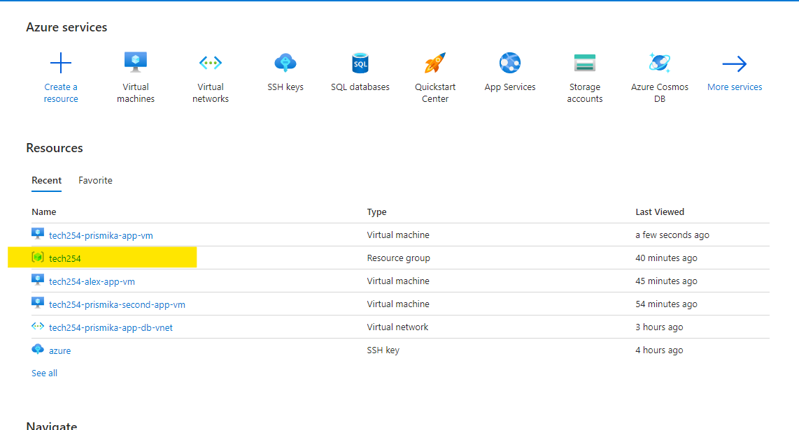
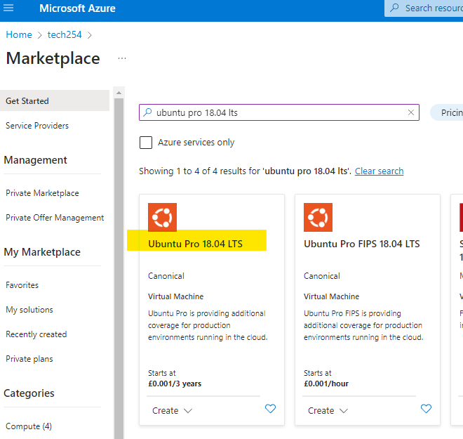
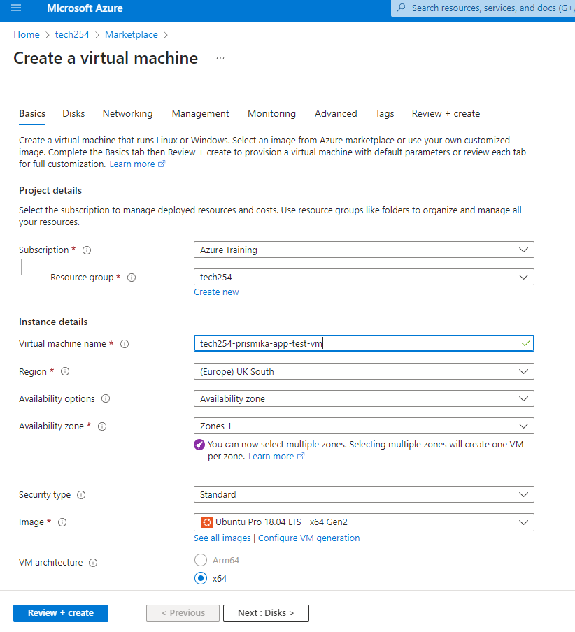
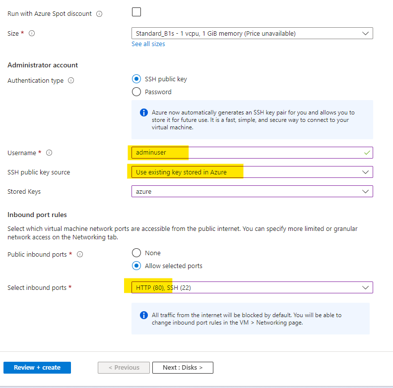
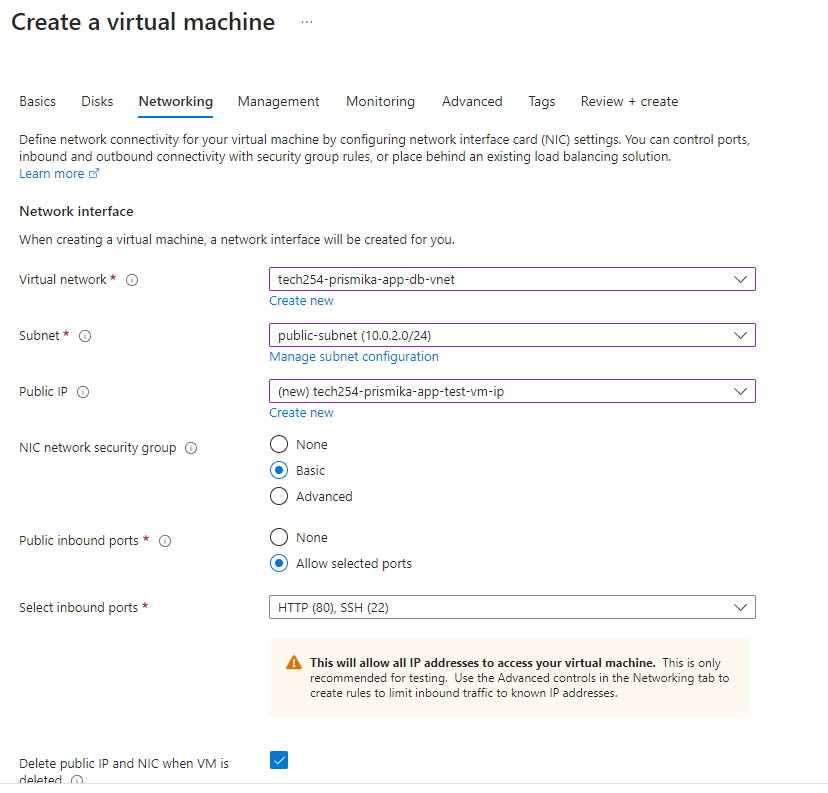
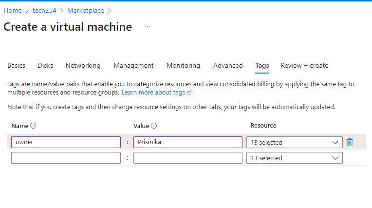
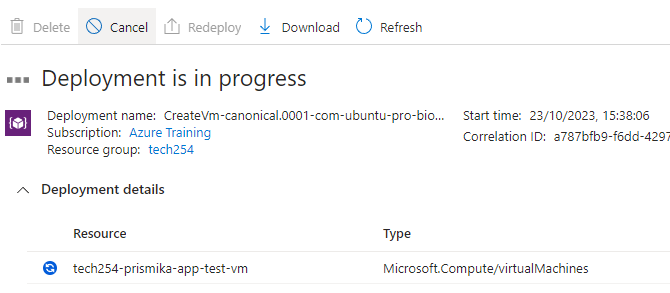
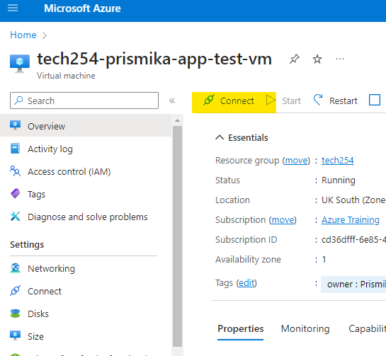
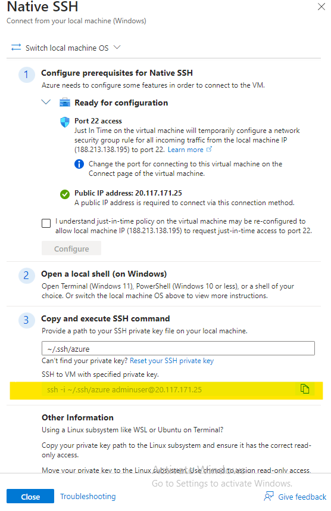
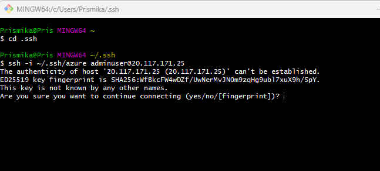

# Setting up an App VM with Azure

#### Creating a Virtual Machine
1) Log into Azure portal and select the resource group [tech254], followed by create on top left.
   
    

    

2) Search for "Ubuntu pro 18.04 lts" followed by pressing create. 
   
   

3) Now, we need to select our resource group, a name for your vm as below. 
   
   

4) Select Standard B1s size followed by selecting your SSH key that we have stored in our azure. Then finally add an inbound port for HTTP. 
   
    

5) On OS disk type, I have selected standard SSD followed by ticking delete with VM. 

    

6) For the virtual network, I have selected the virtual network which I have created, followed by assigning my app virtual machine to public subnet and then assigning public IP. 
   
   

7) Finally, for the tags, I have selected owner followed by name and selected review and create.
   
    

    

#### SSH into VM

1) After your VM has been created, select connect on the top of the bar. 

    

2) Select Native SSH. 
   
   

3) You will see a SSH connect bar on the right hand side, copy the command and paste on your gitbash terminal. 

    
   
   
 4) We will SSH into our VM. 

    

5) I want to create a provision file in order to execute my script so I can test it out before implementing this on the user data on Azure. So we need to run `sudo nano provision.sh` 
   
   

6) In the provision.sh file, 