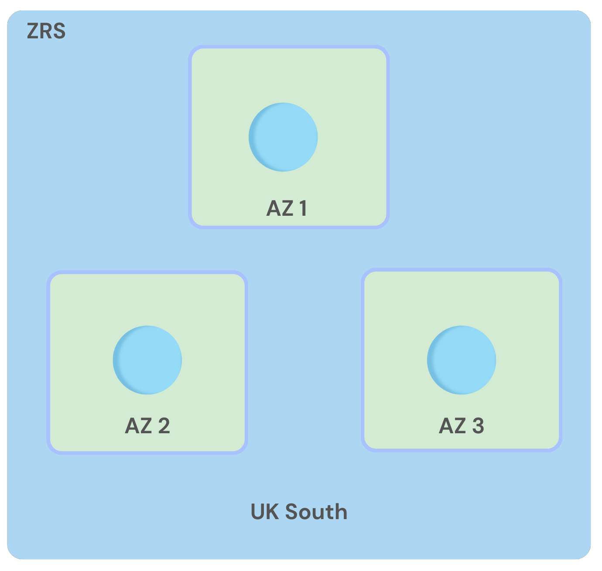

# Azure Blob Storage 

### What is Blob Storage?

Blob storage is a cloud based storage provided by Azure. Its designed to store large amounts of unstructured data, such as pictures, videos, audio files etc. 

### Different types of Storage Tiers

There are three different storage tiers to choose from based on how much you access the data:

**Hot Access Tier**
- Frequently accessed data and you are able to access these datas quickly when you need it. 

**Cool Access Tier**
- Lower storage cost that Hot access tier however takes slightly longer to access it. 
- Long term storage that may need to accesssed occasionally. 

**Archival Tier**
- Offers the lowest storage costs however it takes the highest time in order to access the data. 
- Data that you want to access either monthly or yearly. 

### Azure Storage redundancy

**Locally redundant storage (LRS)**

LRS replicates your storage account three times within a single data center in the primary region.
It creates backups within the same data center, so if a server or drive fails, your data is safe. 

However, in extreme events like fires or floods in the data center, all copies of your data might be permanently lost.

**Zone-redundant storage (ZRS)**

Zone-redundant storage (ZRS) replicates your storage account across three Azure availability zones in the primary region. 

