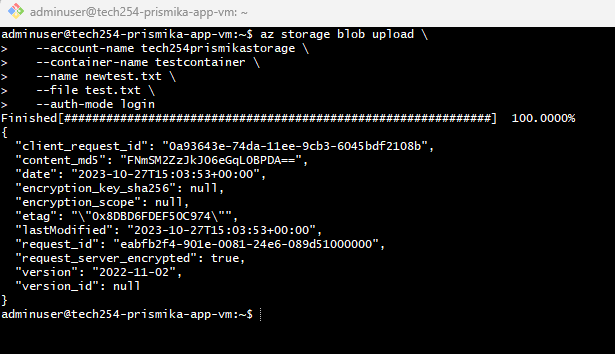

# Creat Blob storage and Upload Blob through Azure CLI

### Step 1: Create new vm on Azure

Make sure to include app user data however remove pm2 start app.js at the end of your data. 

### Step 2: SSH into your vm

SSH into your app vm and download Azure cli. Then log in Azure using Azure cli (including authenticating and logging in manually from browser)

```bash
curl -sL https://aka.ms/InstallAzureCLIDeb | sudo bash  
```
```
az login 
```
### Step 3: Create a storage account 

This command creates a new storage account in the resource group defined and  the region.

```bash
az storage account create --name tech254prismikastorage --resource-group tech254 --location uksouth --sku Standard_ZRS
```


### Step 4: Create a container

This creates a container named "testcontainer" within the storage account.

```bash

az storage container create\
 --account-name tech254prismikastorage \
 --name testcontainer\
 --auth-mode login
```

### Step 5: Create a file and Upload a blob

Run the following command to create a file:

```bash
touch test.txt
ls
sudo nano test.txt
```


Now lets upload a blob:

```bash
az storage blob upload \
   --account-name tech254prismikastorage \
   --container-name testcontainer \
   --name newtest.txt \
   --file test.txt \
   --auth-mode login #doesnt need backlash here as there is not a line after this
```

Output: 



### Step 6: Access your blob storage on Azure

Type storage accounts on the search bar and select your storage account. 


Select containers on the left side bar and your blob that you uploaded is located here. 


Click on your blob, copyt and paste the URL to look at your blob. *The blob is private therefore we cannot view it.*


### Step 7: Change access level of Blobs

 In order to read/view our blob, we can change the access level. Select **change access level** and select **Blob** under Anonymous access level > press **ok**. 


Copy and paste the URL again and now you will be able to see your blob! 


