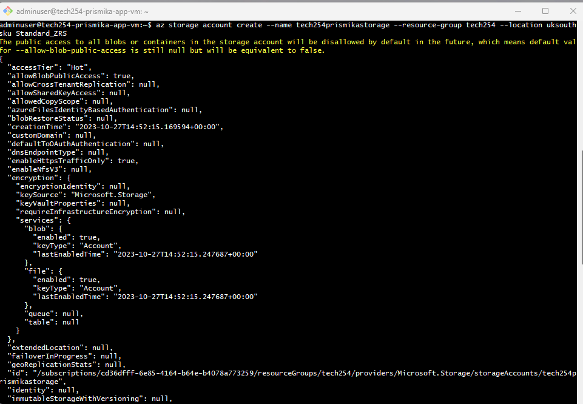
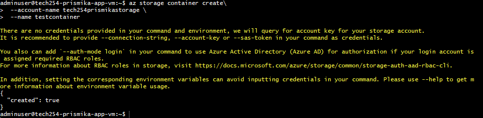
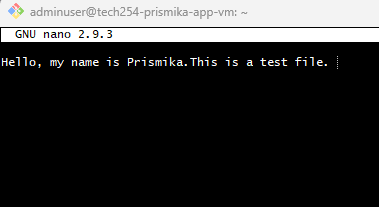
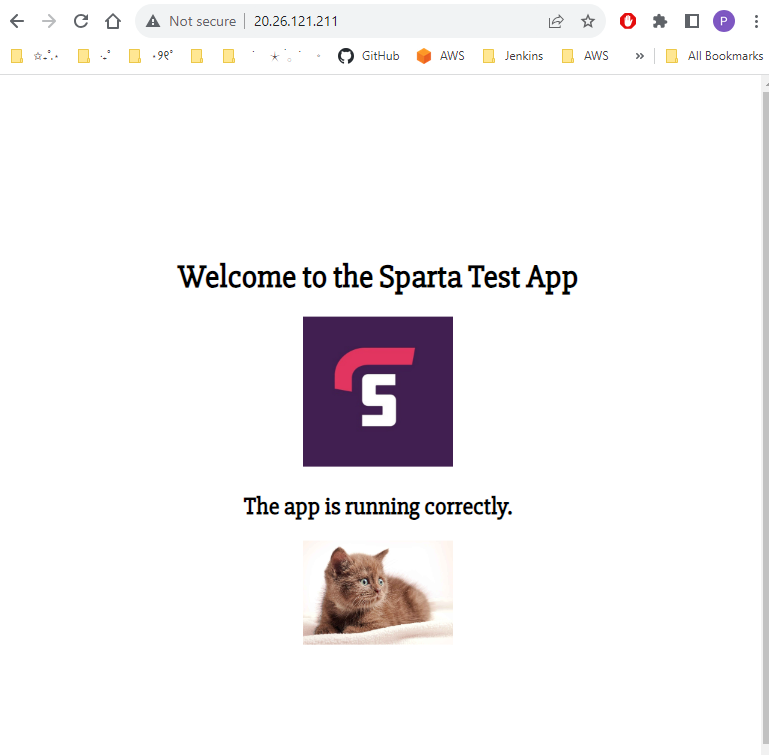

# Creating Blob storage through Azure CLI

1) Log in Azure cli 

```bash
az login 
```

2) Authorise azure cli with GitBash 

2) C****reate a storage account****

```bash
az storage account create --name tech254prismikastorage --resource-group tech254 --location uksouth --sku Standard_ZRS
```



1) ****Create a container****

```bash

az storage container create\
 --account-name tech254prismikastorage \
 --name testcontainer\
 --auth-mode login
```

***You need to have the right permission/ role to containers and blob storage otherwise you will not be able to access it.*** 



**4) Create a file and Upload a blob**

```bash
touch test.txt
ls
sudo nano test.txt
```


```bash
az storage blob upload \
   --account-name tech254prismikastorage \
   --container-name testcontainer \
   --name newtest.txt \
   --file test.txt \
   --auth-mode login #doesnt need backlash as there is not a line after this
```


1) Access your container 


**6) Change access level** 


**Download a Cat Picture using Curl:**

```bash
curl -o cat.jpg [https://cat-world.com/wp-content/uploads/2022/05/brown-kitten.jpg](https://cat-world.com/wp-content/uploads/2022/05/brown-kitten.jpg)
```


**Rename the Cat Picture:**

```bash
mv cat.jpg cutecat.jpg
```


**Upload Blob:**

```bash
az storage blob upload \
   --container-name testcontainer \
   --name newcat.jpg \
   --file cutecat.jpg \
   --account-name tech254prismikastorage \
   --auth-mode login
```


**Make Blob Public:**

**Modify Homepage File (index.ejs):**

```bash
sed -i 's|</h2>\n||' views/index.ejs
```

