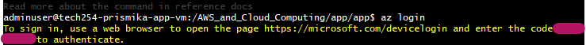

## Installing and Setting up Azure CLI using Git Bash

#### Step 1: Download and Install Azure CLI
Use the following command to download Azure CLI installer directly. [Source](https://learn.microsoft.com/en-us/cli/azure/install-azure-cli)

```bash
curl -sL https://aka.ms/InstallAzureCLIDeb | sudo bash 
```
#### Step 2: Log in 

Type the following command to initiate the login process.

```
az login
```



#### Step 3: Verify and Authenticate in Browser 

Follow the link provided in the terminal, type the code from the terminal and finally sign in to your azure account. 


After successful authentication, you will be redirected back to the Git Bash terminal.
