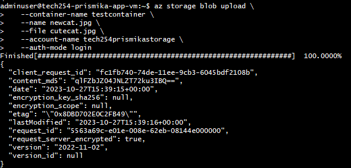
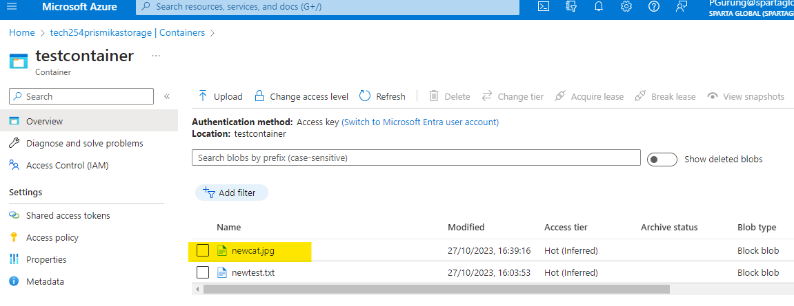
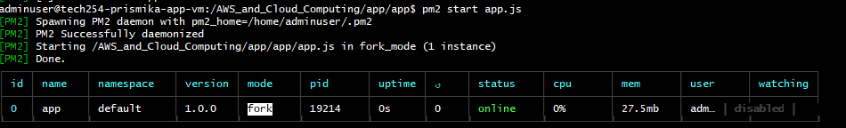
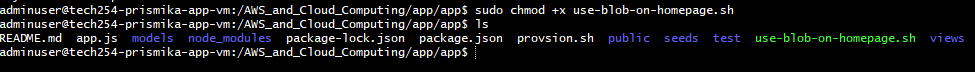

# Creating Script to modify App homepage using Blob 

Before we create a script to modify our app homepage using blob, lets test the commands first. 

## Testing 

#### Download a Cat Picture using Curl

```bash
curl -o cat.jpg https://cat-world.com/wp-content/uploads/2022/05/brown-kitten.jpg
```


#### Rename the Cat Picture

```bash
mv cat.jpg cutecat.jpg
```

#### Upload Blob and Check on Azure 

```bash
az storage blob upload \
   --container-name testcontainer \
   --name newcat.jpg \
   --file cutecat.jpg \
   --account-name tech254prismikastorage \
   --auth-mode login
```




#### Make Blob Public

```bash
az storage container set-permission \
 --name testcontainer \
 --account-name tech254prismikastorage \
 --public-access blob \
 --auth-mode key
```

#### Modify App Homepage File (index.ejs)

Navigate to directory where the **index.ejs** file is and run the following commands: 

```bash
cd/AWS_and_Cloud_Computing/app/app
```

```bash
sed -i 's|</h2>\n||' views/index.ejs
```

#### Run the App

```bash
pm2 kill

pm2 start app.js
```


#### Copy & paste your vm public IP


## Creating a script to modify app homepage using blob

On your gitbash terminal create a new sh file. 

```bash
sudo nano use-blob-on-homepage.sh
```

 This script creates a storage account, container, downloads an image, uploads it to the container, sets public access, modifies the index.ejs file, and finally runs our app.js file. 

```bash
#Creates a storage account 
az storage account create --name tech254prismikastorage --resource-group tech254 --location uksouth --sku Standard_ZRS

#Creates a container in the storage account
az storage container create\
 --account-name tech254prismikastorage \
 --name testcontainer\
 --auth-mode login

# Downloads an image of a cat from a URL and renames it
curl -o cat.jpg https://cat-world.com/wp-content/uploads/2022/05/brown-kitten.jpg

mv cat.jpg cutecat.jpg

#Uploads cutecat.jpg to the testcontainer.
az storage blob upload \
   --container-name testcontainer \
   --name newcat.jpg \
   --file cutecat.jpg \
   --account-name tech254prismikastorage \
   --auth-mode login

#Sets public access to the container
az storage container set-permission --name testcontainer --public-access blob --account-name tech254prismikastorage --auth-mode login

#naviagates to app folder
cd/AWS_and_Cloud_Computing/app/app

#Makes a change in the views/index.ejs file
sed -i 's|</h2> \n||' views/index.ejs

#Stops any running PM2 processes
pm2 kill

#Starts the app.js application with PM2.
pm2 start app.js

```
Set execute permission and finally execute the script. 
```
sudo chmod +x use-blob-on-homepage.sh
sudo ./use-blob-on-homepage.sh
```

