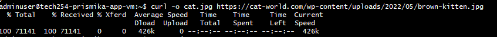
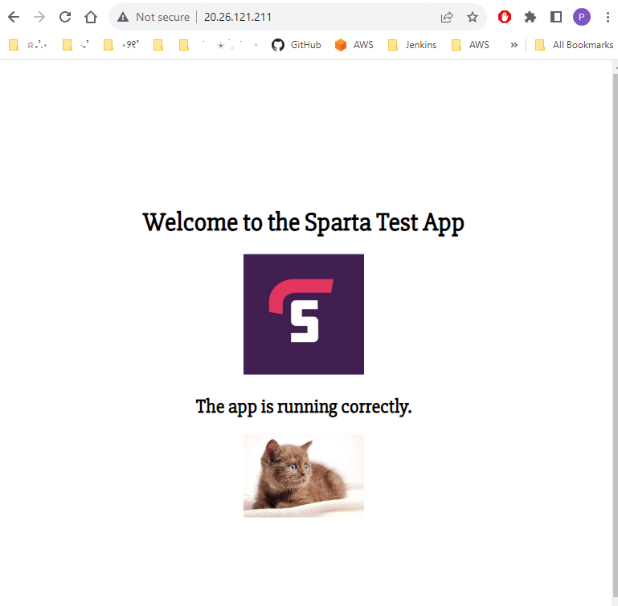

# Creating Script to modify App homepage using Blob 

Before we create a script to modify our app homepage using blob, lets test the commands first. 

## Testing 

#### Download a Cat Picture using Curl

```bash
curl -o cat.jpg https://cat-world.com/wp-content/uploads/2022/05/brown-kitten.jpg
```


#### Rename the Cat Picture

```bash
mv cat.jpg cutecat.jpg
```

#### Upload Blob and Check on Azure 

```bash
az storage blob upload \
   --container-name testcontainer \
   --name newcat.jpg \
   --file cutecat.jpg \
   --account-name tech254prismikastorage \
   --auth-mode login
```


#### Make Blob Public

```bash
az storage container set-permission \
 --name testcontainer \
 --account-name tech254prismikastorage \
 --public-access blob \
 --auth-mode key
```

#### Modify App Homepage File (index.ejs)

Navigate to directory where the **index.ejs** file is and run the following commands: 

```bash
cd/AWS_and_Cloud_Computing/app/app
```

```bash
sed -i 's|</h2>\n||' views/index.ejs
```

#### Run the App

```bash
pm2 kill

pm2 start app.js
```


#### Copy & paste your vm public IP

