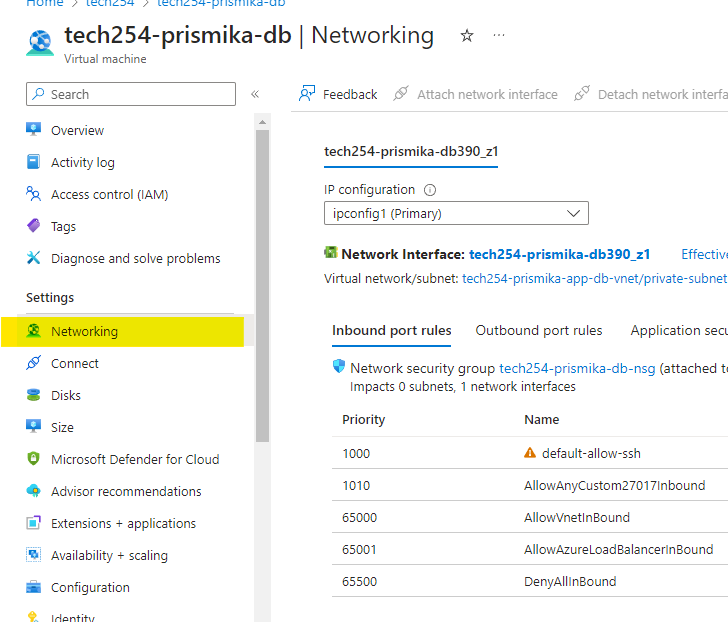
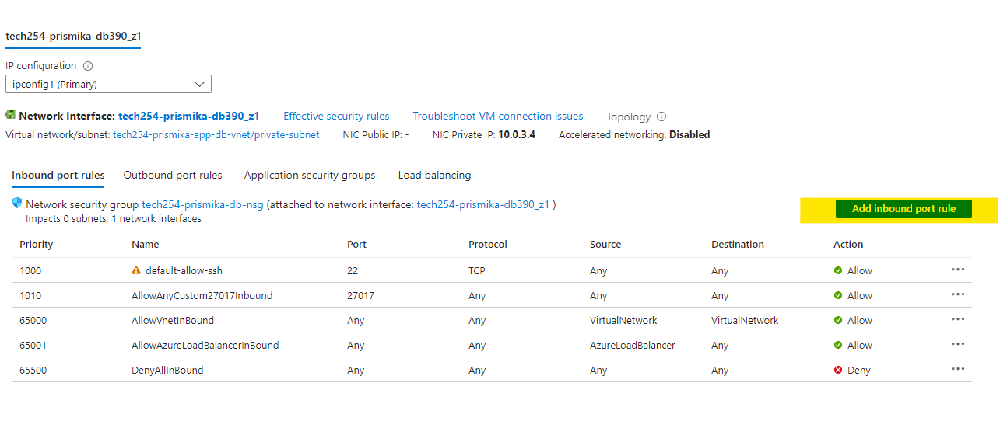
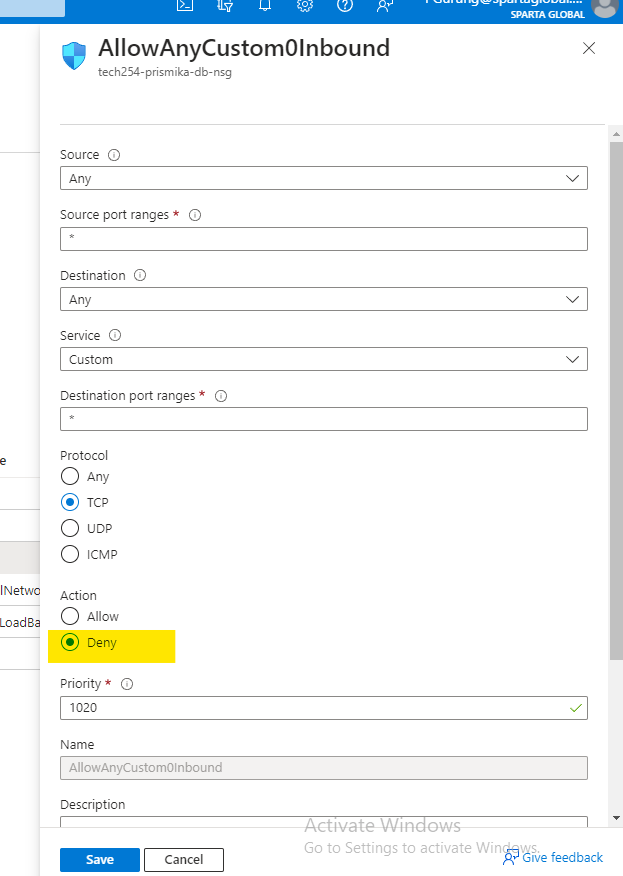
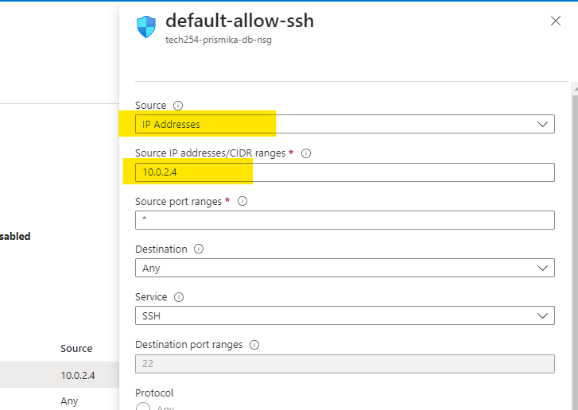
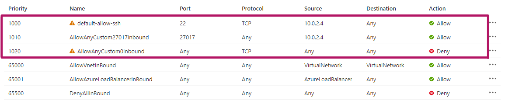

## Setting Inbound Rules on Database VM (DB)

In this document, I will be showing how to update inbound rules in order to lock down network security group in the database VM.

1) Go onto your database virtual machine, select overview and select networking on the left hand side.
   
   

2) Select add inbound rules, we are going to add inbound port rule and make the priority higher than the 3 default ones so it blocks the default rules. Save your rule.
   
   

   

3) Click on your SSH inbound rule, and select IP addresses from source followed by typing in your private IP address of your app vm and we will do the same for our mongodb too. 
   
    

4) This is what you should see now in your inbound rules overview. 
   
   

