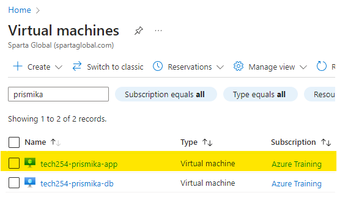
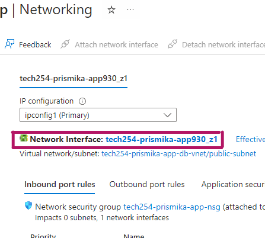
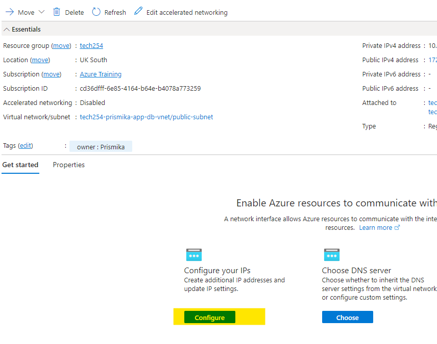
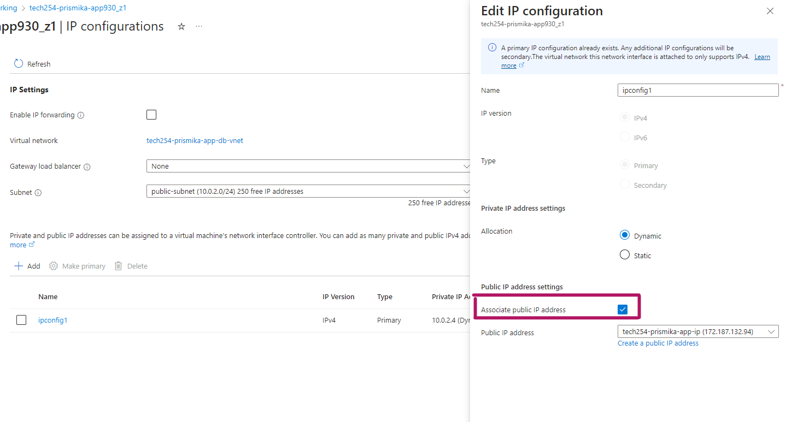
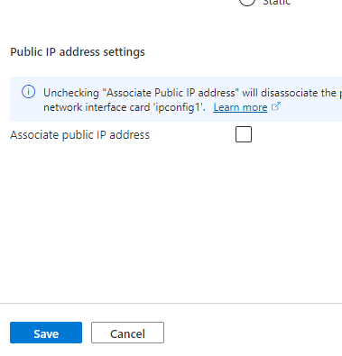
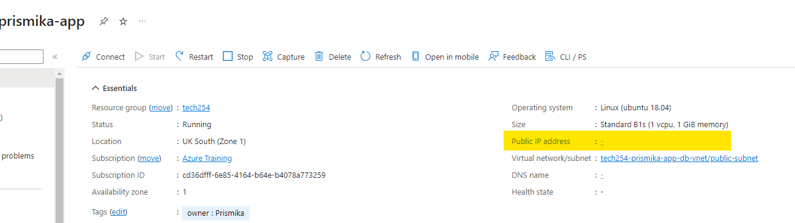

## Unassociate Public IP address from App VM

1) Navigate to virtual machine on the top and select your app vm. 

    

2) Select networking on the side bar, then click on network interface. 

    

3) Click on configure under configure your IPs. 
   
   

4) On the bottom, click on the public IP address and untick the box that says associate public IP address then save. 
   
   

   

5) Go back to your app vm, you should now see that there is no public ip address assigned. 
   
   